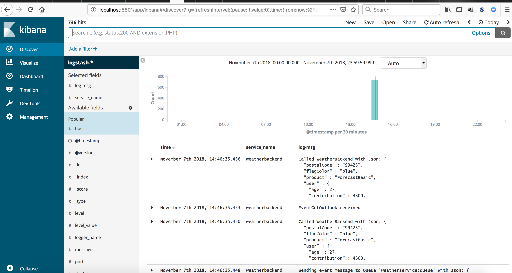

spring-rabbitmq-messaging-microservices
======================================================================================
[](https://github.com/jonashackt/spring-rabbitmq-messaging-microservices/actions)
[](https://renovatebot.com)

Example project showing how to build a scalable microservice architecture using Spring Boot &amp; RabbitMQ


We´re using [RabbitMQ Docker image](https://hub.docker.com/_/rabbitmq/) here. So if you fire it up with `docker-compose up -d`, you can easily login to the management gui at http://localhost:15672 using `guest` & `guest` as credentials.

### Testcontainers only inside weatherbackend


Although we could also use [docker-compose.yml](docker-compose.yml) right here in the weatherbackend test classes, this could lead to errors - because [testcontainers](https://www.testcontainers.org/) would also try to spin up a `weatherbackend` Docker container, which we don´t have at build time of the weatherbackend itself (cause the Spring Boot jar isn´t ready right then).

But there´s something like the `org.testcontainers.containers.GenericContainer` we can use to spin up a RabbitMQ without a docker-compose.yml. Just have a look into the test class [SendAndReceiveTest](weatherbackend/src/test/java/de/jonashackt/SendAndReceiveTest.java):

```
...
import org.junit.ClassRule;
import org.junit.Rule;
...
import org.junit.runner.RunWith;
import org.springframework.beans.factory.annotation.Autowired;
import org.springframework.boot.test.context.SpringBootTest;
import org.springframework.boot.test.util.TestPropertyValues;
import org.springframework.context.ApplicationContextInitializer;
import org.springframework.context.ConfigurableApplicationContext;
import org.springframework.test.context.ContextConfiguration;
import org.springframework.test.context.junit4.SpringRunner;
import org.testcontainers.containers.GenericContainer;
import org.testcontainers.containers.wait.strategy.Wait;
...

@RunWith(SpringRunner.class)
@SpringBootTest(classes = WeatherBackendApplication.class)
@ContextConfiguration(initializers = {SendAndReceiveTest.Initializer.class})
public class SendAndReceiveTest {

    static class Initializer implements ApplicationContextInitializer<ConfigurableApplicationContext> {

        @Override
        public void initialize(ConfigurableApplicationContext configurableApplicationContext) {

            TestPropertyValues.of(
                    "spring.rabbitmq.host=" + rabbitMq.getContainerIpAddress(),
                    "spring.rabbitmq.port=" + rabbitMq.getMappedPort(5672))
                    .applyTo(configurableApplicationContext.getEnvironment());
        }
    }

    @ClassRule
    public static GenericContainer rabbitMq = new GenericContainer("rabbitmq:management")
            .withExposedPorts(5672)
            .waitingFor(Wait.forListeningPort());
```

As Testcontainers doesn´t guarantee that the RabbitMQ container is reachable under the host name `localhost` (see https://github.com/testcontainers/testcontainers-java/issues/669#issuecomment-385873331) and therefore the test execution leads to `ConnectionRefused` Exceptions from the Spring Boot Autoconfiguraiton trying to reach RabbitMQ on this host, we need to go a different path.

But since we need to configure the RabbitMQ host url and port in the early stage of SpringBootTest initialization, we need the help of a `org.springframework.context.ConfigurableApplicationContext` to dynamically set our `spring.rabbitmq.host` property. Togehter with [TestPropertyValues](https://dzone.com/articles/testcontainers-and-spring-boot) this could be done easily as seen in the code.


### Testcontainers, the 'real' docker-compose.yml and the weatherservice

At the weatherservice we´re also using [testcontainers](https://www.testcontainers.org/) to fully instanciate every microservice needed to test the whole interaction with RabbitMQ:


Therefore the sequence of module build inside our [pom.xml](pom.xml) here is crucial:

```
	<modules>
		<module>weathermodel</module>
		<module>weatherbackend</module>
		<module>weatherservice</module>
	</modules>
```
First the shared domain & event classes are packaged into a .jar file, so that every service is able to use it.

Then the weatherbackend is build and tested - which does everything in the context of one microservice.

The final `weatherservice` build then uses the successful build output of the `weatherbackend` inside the corresponding [Dockerfile](weatherbackend/Dockerfile):

```
...
# Add Spring Boot app.jar to Container
ADD "target/weatherbackend-0.0.1-SNAPSHOT.jar" app.jar
...
```

Now the service definition inside the [docker-compose.yml](docker-compose.yml) again uses that Dockerfile to spin up a microservice Docker container containing the `weatherbackend`:

```
version: '3.7'

services:

 rabbitmq:
  image: rabbitmq:management
  ports:
    - "5672:5672"
    - "15672:15672"
  tty:
    true

 weatherbackend:
  build: ./weatherbackend
  ports:
    - "8090"
  environment:
    - "SPRING.RABBITMQ.HOST=rabbitmq"
  tty:
    true
  restart:
    unless-stopped
```

Note the definition of the environment variable `spring.rabbitmq.host`, since the RabbitMQ containers´ host inside the weatherbackend´s Docker Container isn´t `localhost` but instead Docker DNS style `rabbitmq`!

The Test class [WeatherServiceSendAndReceiveTest](weatherservice/src/test/java/de/jonashackt/WeatherServiceSendAndReceiveTest.java) uses `org.testcontainers.containers.DockerComposeContainer` to leverage to `real` docker-compose.yml:

```
package de.jonashackt;

import com.fasterxml.jackson.core.JsonProcessingException;
import de.jonashackt.messaging.MessageSender;
import org.junit.ClassRule;
import org.junit.Rule;
import org.junit.Test;
import org.junit.contrib.java.lang.system.SystemOutRule;
import org.junit.runner.RunWith;
import org.springframework.beans.factory.annotation.Autowired;
import org.springframework.boot.test.context.SpringBootTest;
import org.springframework.test.context.junit4.SpringRunner;
import org.testcontainers.containers.DockerComposeContainer;
import org.testcontainers.containers.wait.strategy.Wait;

import java.io.File;

import static de.jonashackt.common.ModelUtil.exampleEventGetOutlook;
import static de.jonashackt.messaging.Queues.QUEUE_WEATHER_BACKEND;
import static org.hamcrest.Matchers.containsString;
import static org.junit.Assert.assertThat;

@RunWith(SpringRunner.class)
@SpringBootTest(classes = WeatherServiceApplication.class)
public class WeatherServiceSendAndReceiveTest {

    @ClassRule
    public static DockerComposeContainer services =
            new DockerComposeContainer(new File("../docker-compose.yml"))
                    .withExposedService("rabbitmq", 5672, Wait.forListeningPort())
                    .withExposedService("weatherbackend", 8090, Wait.forListeningPort());

    @Rule
    public final SystemOutRule systemOutRule = new SystemOutRule().enableLog();

    @Autowired
    private MessageSender messageSender;

    @Test
    public void is_EventGetOutlook_send_and_EventGeneralOutlook_received() throws JsonProcessingException, InterruptedException {

        messageSender.sendMessage(QUEUE_WEATHER_BACKEND, exampleEventGetOutlook());

        Thread.sleep(5000); // We have to wait a bit here, since our Backend needs 3+ seconds to calculate the outlook

        assertThat(systemOutRule.getLog(), containsString("EventGeneralOutlook received in weatherservice."));
    }
}
```


### Scale weatherbackend & observe, which retrieves the Events with Elastic stack

To scale the weatherbackend Docker Containers, we can easily facilitate Docker Compose services scaling:

```
docker-compose up -d --scale weatherbackend=3
```

Now we have 3 weatherbackends, as the original architecture diagram suggests:


If we fire up our `weatherservice` now, we can send events that one of the weatherbackends will retrieve. But which is retrieving which event? We need to use log correlation like with the [Elastic stack](https://www.elastic.co/) for that. The easiest way to do so, is to use https://github.com/jonashackt/docker-elk. Just clone this repo and do another `docker-compose up -d`.

To connect our microservices to the Elastic stack, there are multiple possibilties. An easy way is to use the [logstash-logback-encoder](https://github.com/logstash/logstash-logback-encoder) and configure it via a `logback-spring.xml` inside the `resources` directory in each app:

```
<?xml version="1.0" encoding="UTF-8"?>
<configuration>
    <include resource="org/springframework/boot/logging/logback/base.xml"/>
    <logger name="org.springframework" level="WARN"/>
	<logger name="de.jonashackt" level="DEBUG"/>

    <!-- Logstash-Configuration -->
	<!-- For details see https://github.com/logstash/logstash-logback-encoder -->
	<appender name="logstash" class="net.logstash.logback.appender.LogstashTcpSocketAppender">
		<destination>localhost:5000</destination>
		<!-- encoder is required -->
	   <encoder class="net.logstash.logback.encoder.LogstashEncoder">
	   	<includeCallerData>true</includeCallerData>
	   	<customFields>{"service_name":"weatherservice"}</customFields>
	   	<fieldNames>
	   		<message>log-msg</message>
	   	</fieldNames>
	   </encoder>
	   <keepAliveDuration>5 minutes</keepAliveDuration>
	</appender>
	
	<root level="INFO">
	    <appender-ref ref="logstash" />
	</root>
	
</configuration>
```

Now with everything in place, fire a request to `weatherservice` with ``.

Open up Kibana after successful startup at http://localhost:5601/app/kibana and first create an index pattern after in __Management/Index Patterns__ called: `logstash-*`. Then click __Next step__ and choose `@timestamp` from the dropdown. Finally click __Create index pattern__. Then head over to __Discover__. Now fire up some events after starting `weatherservice`:

```
curl -v localhost:8095/event
# or 100 events like this
curl -v localhost:8095/events/100
```

Now we should see our services working:




### Scale Containers automatically depending on workload

Initialize local Swarm mode:

```
docker swarm init
```

Now deploy our application as Docker Stack

```
docker stack deploy --compose-file docker-stack.yml {{ application_stack_name }}
```


### Architects heaven: GitHub + Diagram + Markdown-Code

Should be easy right?! I tried: https://yuml.me/diagram/scruffy/class/samples and there´s also a nice editor:

[https://yuml.me/diagram/scruffy/class/edit/](https://yuml.me/diagram/scruffy/class/edit/[weatherservice]->[RabbitMQ],[weatherservice]^-.-[RabbitMQ],[RabbitMQ]->[weatherbackend03],[RabbitMQ]^-.-[weatherbackend03],[RabbitMQ]->[weatherbackend02],[RabbitMQ]^-.-[weatherbackend02],[RabbitMQ]->[weatherbackend01],[RabbitMQ]^-.-[weatherbackend01])